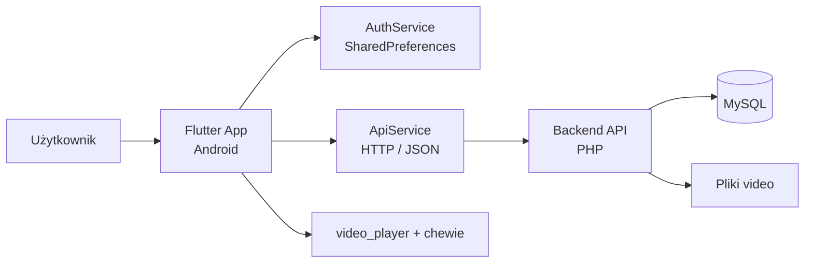
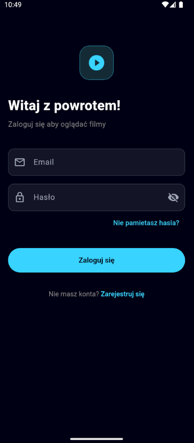
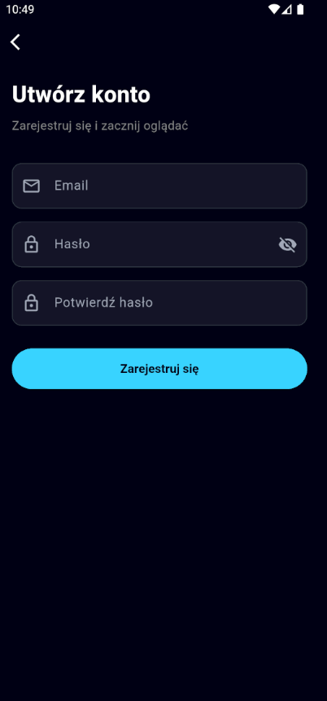
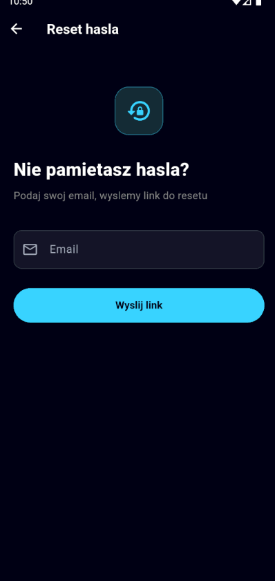
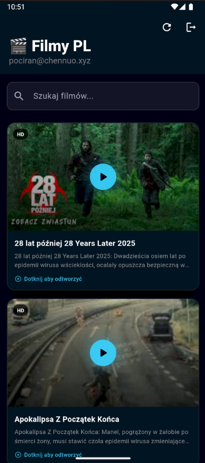
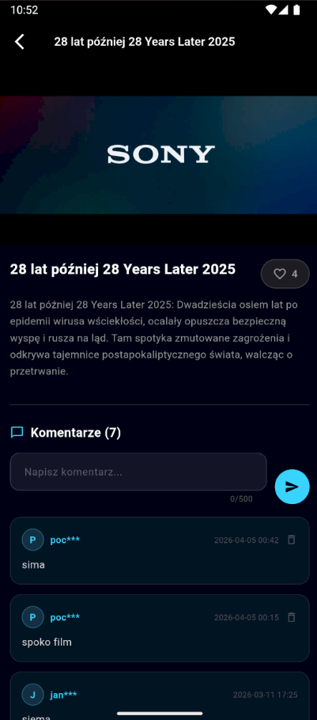

**Aplikacja moblina na (Android) pisana we flutterze. **Potwierdzenie zasad pracy

# flutterarchitektura

Aplikacja mobilna do przeglądania i odtwarzania filmów, napisana we Flutterze.
Backend jest współdzielony z wersją webową i działa jako osobny projekt na tym samym API.

---

## O projekcie

To jest aplikacja Android-first, która po zalogowaniu pokazuje listę filmów,
pozwala je odtwarzać, lajkować i komentować. Stan logowania jest zapamiętywany lokalnie,
a każda autoryzowana prośba do API dołącza token bearer.

---

## Struktura projektu

```text
filmy_pl/
├── lib/
│   ├── main.dart               # start aplikacji, motyw, orientacja ekranu
│   ├── models/
│   │   ├── video.dart
│   │   └── comment.dart
│   ├── screens/
│   │   ├── splash_screen.dart
│   │   ├── home_screen.dart
│   │   ├── video_player_screen.dart
│   │   └── auth/
│   │       ├── login_screen.dart
│   │       ├── register_screen.dart
│   │       └── forgot_password_screen.dart
│   ├── services/
│   │   ├── api_service.dart    # cała komunikacja z backendem
│   │   └── auth_service.dart   # token i email użytkownika
│   └── widgets/
│       └── video_card.dart
```

---

## Jak działa aplikacja

Po starcie aplikacja pokazuje ekran splash, sprawdza zapisany token i kieruje
użytkownika do ekranu logowania albo do ekranu głównego. Na ekranie głównym
wyświetlana jest lista filmów z wyszukiwaniem. Po wejściu w film uruchamia się
player, a pod nim dostępne są lajki i komentarze.

---

## Autoryzacja

Logowanie odbywa się przez email i hasło. Serwer zwraca token bearer, który jest
przechowywany lokalnie w `SharedPreferences` i używany w kolejnych żądaniach.

Obsługiwane akcje:

- rejestracja konta
- logowanie i wylogowanie
- odzyskiwanie hasła przez email

---

## Komunikacja z API

Wszystkie żądania przechodzą przez `ApiService` do backendu PHP.

| Endpoint          |              Metoda | Opis                                    |
| ----------------- | ------------------: | --------------------------------------- |
| `register`        |                POST | Tworzenie konta                         |
| `login`           |                POST | Logowanie i zwrot tokenu                |
| `logout`          |                POST | Unieważnienie sesji                     |
| `videos`          |                 GET | Pobranie listy filmów                   |
| `like`            |          GET / POST | Pobranie i przełączenie lajka           |
| `comments`        | GET / POST / DELETE | Pobranie, dodanie i usuwanie komentarzy |
| `forgot_password` |                POST | Wysłanie linku do resetu hasła          |

Odtwarzacz wideo korzysta bezpośrednio z adresu filmu zwróconego przez backend
i przekazuje token w nagłówku `Authorization`.

---

## Architektura



---

## Najważniejsze ekrany

- `SplashScreen` - sprawdza sesję i wybiera trasę startową.
- `LoginScreen` - logowanie użytkownika.
- `RegisterScreen` - rejestracja konta.
- `ForgotPasswordScreen` - odzyskiwanie hasła.
- `HomeScreen` - lista filmów, wyszukiwanie i wylogowanie.
- `VideoPlayerScreen` - odtwarzanie, lajki i komentarze.

---

## Technologie

- Flutter / Dart
- `http` do komunikacji z backendem
- `shared_preferences` do lokalnego przechowywania tokenu
- `video_player` i `chewie` do odtwarzania wideo
- `cached_network_image` do obrazków i miniaturek

---

## Uruchomienie

```bash
cd filmy_pl
flutter pub get
flutter run
```

---

## Uwagi

Wersja webowa korzysta z tego samego backendu API, ale jest utrzymywana jako
osobny projekt. Rozdzielenie upraszcza testy i wdrożenia.

## ZDJECIA PONIZEJ

1 ekran logowania - trzeba byc zalogowanym by aplikacja dzialala


ekran rejestracji


ekran przywracania hasla


ekran po zalogowaniu z widocznym na gorze po prawej przyciskiem wylogowania, z lewej strony mailem konta zalogowanego oraz z prawej odswierzeniem strony | widac też rekacje pod filmami oraz polubienia


ekran po wybraniu filmu, są widoczne komentarze i mozliowsc ich zamieszczania

