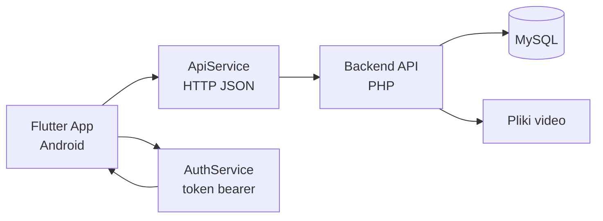

**Aplikacja moblina na (Android) pisana we flutterze. **Potwierdzenie zasad pracy

# flutterarchitektura

Aplikacja mobilna do przeglądania i odtwarzania filmów, napisana w Flutter (Android).
Backend jest wspólny z wersją webową — osobne repo, ten sam serwer API.

---

## Struktura projektu

```
filmy_pl/
├── lib/
│   ├── main.dart               # start aplikacji, motyw, ThemeData
│   ├── models/
│   │   ├── video.dart
│   │   └── comment.dart
│   ├── screens/
│   │   ├── home_screen.dart
│   │   ├── video_player_screen.dart
│   │   └── auth/
│   │       ├── login_screen.dart
│   │       ├── register_screen.dart
│   │       └── forgot_password_screen.dart
│   ├── services/
│   │   ├── api_service.dart    # cała komunikacja z backendem
│   │   └── auth_service.dart   # zarządzanie tokenem sesji
│   └── widgets/
│       └── video_card.dart
```

---

## Jak działa autoryzacja

Użytkownik loguje się emailem i hasłem. Serwer zwraca token bearer,
który jest przechowywany lokalnie i dołączany do każdego zapytania.

Obsługiwane akcje:

- rejestracja konta
- logowanie / wylogowanie
- reset hasła przez email (link z tokenem ważnym 1h)

---

## Komunikacja z API

Wszystkie zapytania idą przez `ApiService` do backendu PHP.

| Endpoint          | Metoda          | Opis                      |
| ----------------- | --------------- | ------------------------- |
| `register`        | POST            | Tworzenie konta           |
| `login`           | POST            | Logowanie, zwraca token   |
| `logout`          | POST            | Unieważnienie tokenu      |
| `videos`          | GET             | Lista filmów              |
| `stream`          | GET             | Strumieniowanie pliku mp4 |
| `like`            | GET/POST        | Lajki do filmów           |
| `comments`        | GET/POST/DELETE | Komentarze do filmów      |
| `forgot_password` | POST            | Reset hasła przez email   |

---

## Architektura



---

## Wersja webowa

Wersja webowa korzysta z tego samego backendu API, ale jest utrzymywana
jako osobny projekt. Rozdzielenie upraszcza testy i wdrożenia.
